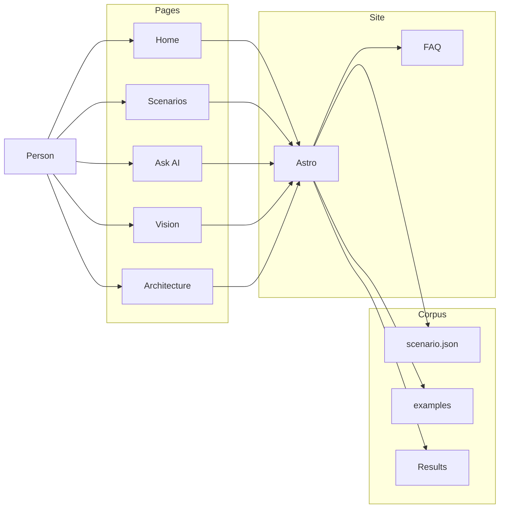
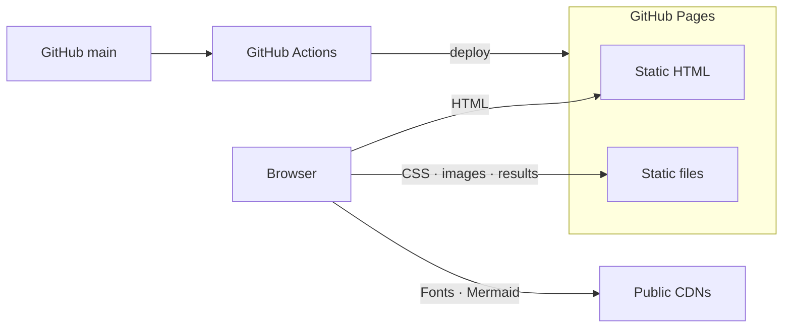

# Architecture and design

**Last updated:** 2026-09-27  
**Status:** Living document — rewrite current-state sections when structure, APIs, UI, or deploy change; prepend a changelog entry the same day.

Product intent lives in [VISION.md](VISION.md). This file is how the system is built.

## How to update

When code, pages, static assets, CI, or public URLs change, update the matching sections here **in the same change**. Do not leave “as designed” text that contradicts the repo. Scenario field changes also update [CONTENT_SCHEMA.md](CONTENT_SCHEMA.md) and `apps/web/src/lib/scenarios.ts`.

## System overview

One static site, built from the repo, with no request-time backend:

```
Browser
        │  GET pages
        ▼
Astro  apps/web          ← HTML, CSS, FAQ matcher
        │
        ├── examples/**/scenario.json + source
        ├── samples/*                 SUTs for CI and local runs
        └── public/results/           CI-cached stdout / stderr
```

Visitors read comparisons. They do not execute tests in the hosted UI. Samples run in GitHub Actions and on a local clone.

## Logical architecture

What the production app does. No hosts or vendors here — only responsibilities. There is no user store: a page is HTML plus files baked in at build time.



| Layer | Runtime job |
|-------|-------------|
| Pages | Home, scenario list and detail, Ask AI, Quality, Vision, Architecture, Run locally, release notes |
| Site | Build HTML from the corpus; match Ask questions to the FAQ |
| Corpus | Scenario metadata, example source, and CI-cached result logs |

## Physical architecture

How that system is hosted in production. Compute is build-scoped. There is no application database.



| Piece | Production fact |
|-------|-----------------|
| HTML | Astro static files in `apps/web/dist` on GitHub Pages |
| Static files | CSS, images, logo, and cached `public/results/` JSON from the same Pages artifact |
| Public CDNs | Google Fonts on every page; Mermaid only on Architecture |
| Corpus | Read at build time from `examples/`, `docs/plan/`, and `apps/web/src/lib/ask.ts` |
| Identity / data store | None |
| CI / release | GitHub Actions on `main`; Pages deploys only after `test-and-build` |

## Layer boundaries

| Layer | Path | May do | Must not do |
|-------|------|--------|-------------|
| Presentation | `apps/web/src/pages/`, layouts, CSS | Render comparisons and docs summaries | Invent scenario facts or run tests |
| Content | `examples/**/scenario.json`, `samples/` | Define the Rosetta idea and SUT | Host a live runner |
| FAQ | `apps/web/src/lib/ask.ts` | Answer from this corpus | Call a paid API as the only path |
| Capture | `scripts/capture-results.mjs` | Write cached logs in CI | Execute in the visitor’s browser |

Browser JS on Ask AI re-runs the same keyword matcher. It must not call an external LLM. Quality and local pages only describe commands; they do not start them.

## Content model

A scenario is one testing idea expressed in N frameworks. Types live in `apps/web/src/lib/scenarios.ts` and [CONTENT_SCHEMA.md](CONTENT_SCHEMA.md).

Load path: walk `examples/` for `scenario.json` at build time (`loadScenarios()`). CI `validate:scenarios` requires id, title, category, at least two variants, and files that exist.

### Scenario page order

1. Optional **story** (human situation).
2. Optional **exercise** (how the approach is used, and when it is effective).
3. **Tool + architecture primer** (`apps/web/src/lib/tools.ts` plus `architecture` on the scenario).
4. Framework tabs: SUT, test file(s), **Results** from `apps/web/public/results/{id}/{framework}.json`.

TDD (`unit.tdd-red-green`) and BDD (`unit.bdd-given-when-then`) always ship story then exercise then files. They do not share a SUT story.

## Web page flow

1. `GET /` — `loadScenarios()` → home list.
2. `GET /scenarios` and `/scenarios/{id}` — catalog and one comparison.
3. `GET /ask` — FAQ matcher in `ask.ts` (also runs in the browser for follow-up questions).
4. `GET /quality` — documents the live CI gates.
5. `GET /local` — clone and run instructions.
6. `GET /vision` — `summarizeVision()` over this folder’s `VISION.md`.
7. `GET /architecture` — `loadArchitecture()` over this file’s logical and physical sections.
8. `GET /releases` and `/releases/{version}` — comments from `apps/web/src/lib/release.ts`.

Production URLs are rooted at https://test-play-ground.aathira-services.com (`GITHUB_PAGES=1` sets `site`; `base` is `/`). `withBase()` prefixes every in-app link.

## UI design

Custom CSS — not a third-party kit.

| Token | Value |
|-------|--------|
| Background | `#f6ead8` parchment veil over a warm `/images/office-bg.png` (cover, fixed, center top) |
| Ink / muted | `#152028` / `#5a6b76` |
| Accent / hover | `#0f4c5c` / `#0c3d4a` |
| Line | `#d8c4aa` |
| Display / body | Source Serif 4 / Source Sans 3 (Google Fonts) |
| Mono | IBM Plex Mono |
| Cards | `rgba(246,234,216,0.92)`, 12px radius, soft shadow, light backdrop blur |
| Header | Sticky, `rgba(246,234,216,0.9)`, blur; Scenarios, Ask AI, Vision, Architecture, Quality, Run locally; release chip |

Layout: content max ~48rem; scenario pages can go wide (~64rem).

## File map

```
apps/web/                 Astro site (pages, styles, FAQ, release notes)
examples/                 Canonical side-by-side scenarios
samples/                  js-counter, js-api, js-ui, python-calc
scripts/                  validate-scenarios.mjs, capture-results.mjs
docs/plan/                Living product + architecture docs
.github/workflows/ci.yml  Validate, test, capture, build, deploy
```

## Testing and CI

- `npm run validate:scenarios` — schema and paths
- `npm test` — unit (including TDD coupon and BDD room), HTTP, UX, performance, security
- `npm run capture:results` — refresh `apps/web/public/results/`
- GitHub Actions (Node 24, Python 3.12): install Chromium, k6, pytest + httpx + pytest-bdd, then the commands above, then `npm run build`
- `deploy` job runs only after `test-and-build` on push to `main` (Pages source = GitHub Actions)
- Visitors can read the gates on `/quality`

There is no live `/api/run`. A red example fails the job; a missing results artifact fails the upload.

## Deployment

- **Local:** `npm install`, Playwright Chromium, k6, `pip install pytest httpx pytest-bdd`, then `npm run dev` on port 4321
- **Production:** GitHub Pages from the `apps/web/dist` artifact. `GITHUB_PAGES=1` sets `site` to the custom domain; `base` stays `/` because that domain serves the project site at its root. `apps/web/public/CNAME` keeps the domain on each deploy.
- No application database. The hosted site is a snapshot of the last green `main` build.

## Design decisions

| Decision | Why |
|----------|-----|
| Static Astro, no runner API | $0 host; no visitor-code sandbox |
| CI-cached Results logs | Show real output without executing in the tab |
| FAQ matcher before RAG | Ships without keys; upgrades without rewrite |
| OSS frameworks only | Matches the product thesis |
| Pages deploy only after green `main` | The examples are the product |
| TDD and BDD as separate stories | Different methods, different SUTs — not one coupon twice |
| Custom CSS | Teal-slate tokens and glass cards without a kit |
| Living docs + in-app summaries | Header Vision / Architecture stay honest with the repo |

## Releases

`apps/web/src/lib/release.ts` holds `RELEASES` (newest first). The header chip is `v{RELEASE_VERSION}` and links to `/releases/{version}`. Root `package.json` and `apps/web/package.json` use the same version string.

Every change that will merge to `main` prepends a release object in the same change (see the bump-release workspace rule). Usual slice = patch; new scenario category or visitor-facing product area = minor.

## Shipping

Personal Cursor skill `ship-to-main`: check in → PR → Bugbot + Security Review → accept → merge. Repo rules `keep-docs-updated` and `bump-release-on-main` run at the start of check-in when those files exist. Self-approval is best-effort (GitHub often blocks approving your own PR).

## Changelog

### 2026-09-27 — Vision and Architecture pages

- Added `/vision` and `/architecture`. This file is now the living current-state map (logical/physical Mermaid, layer boundaries, page flow).
- Retired the “proposed Next.js / live RAG” shape as if it were production. Ask AI remains the FAQ matcher; RAG stays a later phase.
